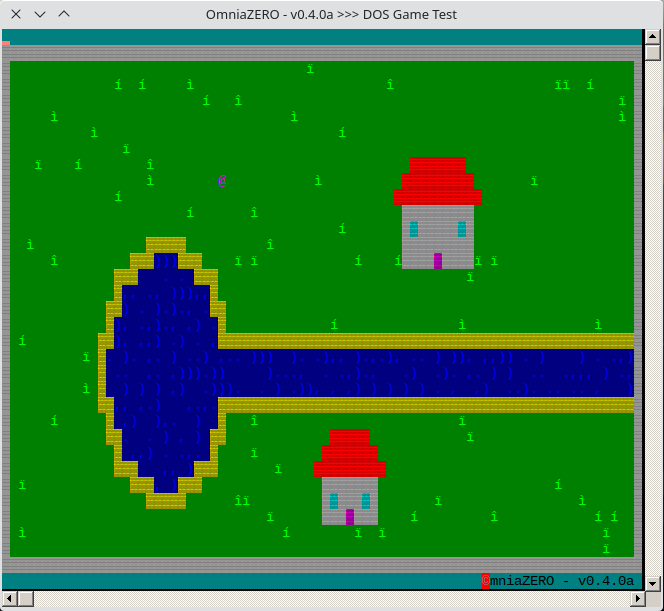

## OmniaZERO - Console RPG Game engine for Windows - Written in C 

This is a small console game engine, geared towards RPG Games, that runs in the Windows Command Line, and is Written entirely in C.
    
It is still in early development; as of right now, the functionality that it includes are:
* Animated-Tiles.
* Storing/Loading of all game data, in a serialized format.
* An external <console.log> file, which if open in a real-time updating text-editor, serves as the log-console.
* Storing/Loading of Worlds, in a serialized format.
* Partial in-game MessageBox functionality.
* Collision detection

The current state of the project. (For this screenshot, it was run using **Wine** on Manjaro Linux.)

    
To compile this project you will need to be on Windows XP or higher, and you will need a version of the gcc compiler installed (for this project I used MinGW).
    
If the requirements are met, you can go into the **<OmniaZERO-Version>\bin** folder, open a command prompt there and type:
```
gcc ../main.c -o game
```
and you will have the **game.exe** file generated.
